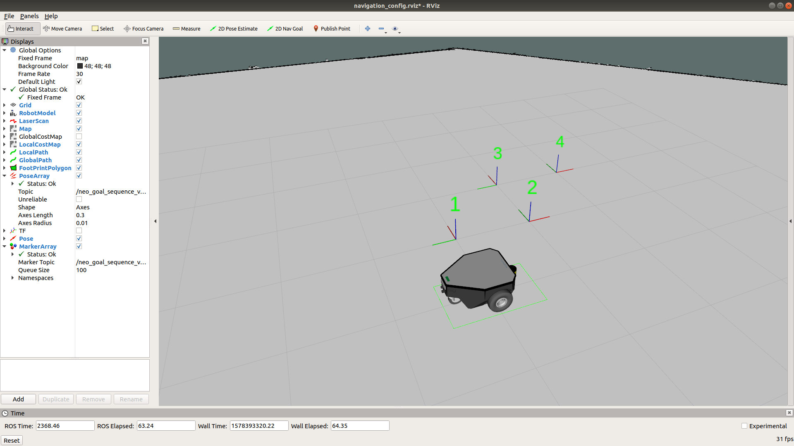

# neo_goal_sequence_driver

## Package for testing basic functionalities of navigation stack.

  

Example setup with our [Simulation](https://github.com/neobotix/neo_simulation) and 4 different goals visualized in Rviz.

Please find our documentations [here](https://docs.neobotix.de/display/TUT/Using+neo_goal_sequence_driver).